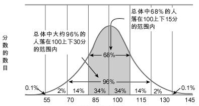

```
受试者姓名：`r params$data_list$name`  
受试者生日：`r as.character(params$data_list$dates[["birth"]])`  
测评日期：`r as.character(params$data_list$dates[["test"]])`  
```

***

`r paste0("## ",params$data_list$full_test)`

`r params$data_list$full_test`评估儿童的一般智力功能，包括`r params$data_list$sub_test`几大指标。韦氏测试结果临床效度高，具有高质量的常模，在儿童智力测试中应用最广泛。该测验总智商分数在正常儿童中的标准分分布如下图所示:  



您的孩子在韦氏幼儿智力测试中的**总智商分数**是：**`r params$data_list$fsiq`**。对于孩子的得分，我们的解释是：您的孩子的智力处于儿童群体的`r params$data_list$fsiq_disp`。您孩子智力结构中各项得分与同龄孩子的比较结果如下图所示[^1]，其中左列“10”分所在位置为该年龄段孩子的平均水平。


 
针对您孩子的得分，我们的解释是：您的孩子在`r params$data_list$full_disp`。需注意的是，测试时孩子的情绪和注意状态都会影响分数。儿童智力不是一成不变的，家长的关怀程度、学校的教师和教育内容是影响儿童智力发展的关键因素，可以在这三方面继续给孩子提供支持。建议您多花时间与孩子交流，在各个方面进一步提高孩子的思维能力，比如让孩子自己解决现实问题，提升其解决问题的能力。另外可以鼓励孩子与其他同龄儿童进行更多的沟通和交流在玩乐中提高适应社会生活能力的发展水平。

[^1]: 若非核心题目在本次评估中并未测量，在结果中将以“无效”表示。

```{r block text, echo=FALSE, results='asis'}
myCondition <- F
if (myCondition) {
  glue::glue(
"
## {params$data_list$full_test}

{params$data_list$full_test}评估儿童的一般智力功能，包括{params$data_list$sub_test}几大指标。韦氏测试结果临床效度高，具有高质量的常模，在儿童智力测试中应用最广泛。该测验总智商分数在正常儿童中的标准分分布如图1所示:


您的孩子在韦氏幼儿智力测试中的**总智商分数**是：**{params$data_list$fsiq}**。对于孩子的得分，我们的解释是：您的孩子的智力处于儿童群体的{params$data_list$fsiq_disp}。您孩子智力结构中各项得分与同龄孩子的比较结果如下图所示[^1]，其中左列“10”分所在位置为该年龄段孩子的平均水平。


 
针对您孩子的得分，我们的解释是：您的孩子在{params$data_list$full_disp}。需注意的是，测试时孩子的情绪和注意状态都会影响分数。儿童智力不是一成不变的，家长的关怀程度、学校的教师和教育内容是影响儿童智力发展的关键因素，可以在这三方面继续给孩子提供支持。建议您多花时间与孩子交流，在各个方面进一步提高孩子的思维能力，比如让孩子自己解决现实问题，提升其解决问题的能力。另外可以鼓励孩子与其他同龄儿童进行更多的沟通和交流在玩乐中提高适应社会生活能力的发展水平。

[^1]: 若非核心题目在本次评估中并未测量，在结果中将以“无效”表示。
")
}
```
